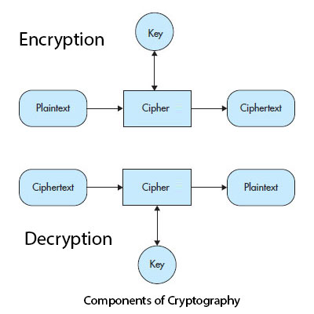

# 密码学术语简介

密码学（cryptography）从两个希腊单词演变而来，就是“crypto”和“graphy”。

每个希腊单词，“crypto”表示“秘密”，“graphy”表示“书写”。

“秘密”的概念随着如Bitcoin、Ethereum、Litecoin等加密货币导入引入愈发流行。

## 密码学是什么

简单地说，加密就是对接获消息的敌方或对手隐藏含义的修改过程。
加密是秘密书写科学，用大量的技术保证信息是不可读格式的。
仅指定的接收者能将此不可读格式转换为可读格式。

在安全电子传输中，加密技术适应安全电子邮件信息、信用卡细节、音视频广播、多媒体存储和别的敏感信息。
通过运用加密系统，发送者首先加密信息，通过网络传送。
另一方面，接收者可以解密消息，恢复原始内容。

## 密码学的组成

- 明文（plaintext）

    可以是文本，二进制编码，或图像，需要转换为任何人不可读格式，除了用密钥解锁的接收者。
    就是发送者要传递的未加密的、最纯粹的消息。

- 密文（ciphertext）

    在加密明文过程、转换为愿意不可读的格式，结果叫作密文。
    就是和加密的消息，接收者所接收到的。
    然而，密文像明文哪像，通过加密处理操作，重新产生最终的输出。
    最终输出包含原始消息，尽管是不可读取，除非官房直到正确的含义或破解编码。

- 加密（encryption）

    接收信息并转换为不可读的、可恢复的格式。
    就是明文到密文的过程。
    加密需要密码算法，叫作译码和密钥。
    若无密钥，没有人能解密被加密的消息的关键信息。
    明文转换为密文是采用加密算法。

- 解密（Decryption）

    是加密的逆过程，将密文转换回明文，用解密算法和密钥。
    在对称加密中，加密解密使用相同的密钥。
    但是，非对称加密或公钥加密，加密解密用不同的密钥。

- 密码算法（Ciphers）

    加密解密密码算法一起被称作密码算法。
    或许是密码学中狡猾的、有趣的和最古怪的部分。
    密码算法不只是某个公式，包括演示密码算法如何在信息上加密解密过程的很多步骤。
    一个基本的密码算法输入一组比特并返回另一组比特，不关心比特组代表的是文本、图像、音视频。

- 密钥（Key）

    密钥通常是一组数字，密码算法在这组数字上操作。
    技术上的说法，密钥是离散的信息片段，用来控制给定密码算法的输出（密文和明文）。
    加密和解密算法需要这个密钥来加密和解密。
    发送者用加密算法和密钥把明文转换为密文。
    接收者用解密算法和密钥把密文转换为明文。
    密钥越长，攻击者破译消息的难度越大。
    