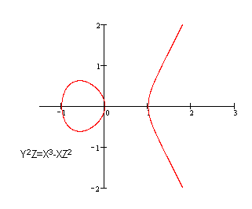
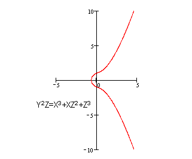
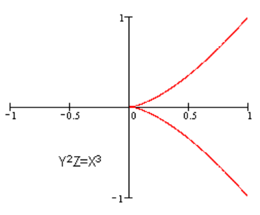
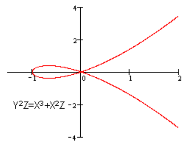
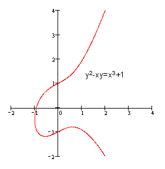
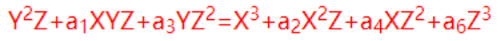
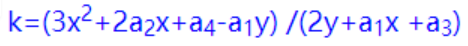
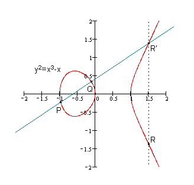
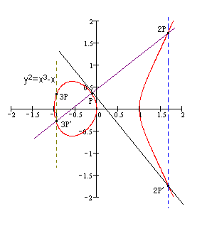

# 符号
- x ≡ y (modn)：x与y模n同余。亦即，x modn = y modn。

# 椭圆曲线
- 因在射影平面坐标系中的方程式和椭圆周长的方程式形式上相似而得名
- 形状并非椭圆
- 是光滑的（支持微积分）

  
  
  - **非光滑的则非椭圆曲线**

    
    

- **并非关于X轴对称**

  

- 有个无穷远点(0:1:0)
- 在射影平面满足维尔斯特拉斯方程

  

- 在普通平面的形式

  

- 切线斜率

  

- 加法（群、环、域）
  - 加群（交换群、阿贝尔群）
  - 实数运算关系的抽象
  - 法则（*一定能有R'和R么？*）：

    取椭圆曲线上任意两点P和Q（若两点重合作该点切线）做直线，
    和椭圆曲线交于另一点R'，过R'作Y轴平行线和椭圆曲线交于R，
    **规定**：P+Q=R。

    

    据此可知：
    椭圆曲线无穷远点和椭圆曲线任一点P的连线交于P'，
    过P'作Y轴平行线和椭圆曲线交于P，
    则有：无穷远点+P=P。

  - 无穷原点作零担当（称作零元）
  - P'称作P的负元（记作-P）

    .png)

  - P是曲线上的一点
  - Q是曲线上的一点
  - P+Q总是曲线上的另一点
  - 三点共线则三点的和等于零元
  - K个相同点的和记作KP

    

- 椭圆曲线上点的阶：椭圆曲线上任意一点P，若存在最小正整数n使得nP=零元，则称n是P的阶，否则P是无限阶。

- 有限离散域
  - Fp只有P个元素（P是素数）
  - Fp的加法法则：a+b=c (mod p)
  - Fp的乘法法则：a*b=c (mod p)
  - Fp的除法法则：a/b=c (mod p)，要求b-1也是[0,p-1]的整数，且b*(b-1)=1 (mod p)
  - Fp的的单位是1，零元是0

## 加密
- 并非全部椭圆曲线都适合加密
  - 形如YY=XXX+aX+b的可用来加密，是最简单的一类
  - 将该椭圆曲线定义在有限离散域
  - 该椭圆曲线所有点的阶都是存在的
  - 将选定元素个数P和a、b参数的有限离散域椭圆曲线记作Ep(a,b)
  - 难题：

    K=kG，其中K和G是Ep(a,b)上的点，k是小于G点阶的整数，给定k和G，根据加法法则很容易得到K，给定K和G，求k就困难啦！
    这就是ECC的数学难题，把G点称作基点，k称作私钥，K称作公钥。
  - 操作过程：

    Alice选定一条椭圆曲线Ep(a,b)并在此椭圆曲线上取基点G；
    Alice选择一个私钥ka，并生成公钥KA=kaG；
    Alice将Ep(a,b)和K、G传送给Bob。

    Bob将明文编码到Ep(a,b)的点M（具体编码方法可选）；
    Bob选择一个私钥Kb，并生成公钥KB=kbG；
    Bob加密编码点为M+kbKA；
    Bob将M+kbKA和KB传送给Alice。

    Alice计算M+kbKA-kakbG=M+kbkaG-kakbG=M+kakbG-kakbG=M；
    Alice从Ep(a,b)解码M得到明文。

    在此通信中，若存在偷窥者Eve，可以看到Ep(a,b)、G、KA(kaG)、KB(kbG)、M+kbKA，通过这些线索反求ka或kb是困难的。

- 密码学中的椭圆曲线
  - 一条Fp上的椭圆曲线，用到六个参量
  - T=(p,a,b,G,n,h)
  - G是基点
  - n是G点的阶
  - h是椭圆曲线所有点的个数m（Fp的点数总额是p进一步由椭圆曲线筛选则m必然不大于p）与n的整除结果
  - 这几个参数的选择，直接影响加密的安全性，一般要求满足以下条件：

    p越大越好、但计算速度越慢，目前两百位左右即可

    p!=n*h

    pt!=1 (mod n), t取1到20、前闭后开

    4aaa+27bb!=0

    n为素数

    h不大于4

- [ECDSA](http://kakaroto.homelinux.net/2012/01/how-the-ecdsa-algorithm-works/)

# 离散对数
- IndLxy=IndLx+IndLy (mod N)

# 素数
- 定义PHI(n)为一个整数包含小于自身且和自身互质的数的个数
- 如果n是素数则有PHI(n)=n-1
- 如果n=p*q且p和q都是素数则有PHI(n)=PHI(p*q)=PHI(p)*PHI(q)=(p-1)*(q-1)
- 欧拉定理：m^PHI(n)=1 (mod n)，m和n互质

## 大素数因式分解

## 对称
- W.Diffie、E.Hellman、R.C.Merkle
  - 在非安全通道交换密钥（DH）

## 公开密钥
- RSA：基于大素数因式分解，若P*Q=N，且P和Q均为大素数，给定N求P和Q。
  - 根据欧拉定理推导出陷门函数：m^(K(PHI(n))+1)=m (mod n)，ed=K(PHI(n))+1

---

# 参考
https://github.com/ARMmbed/mbedtls
https://github.com/guanzhi/GmSSL
http://andrea.corbellini.name/2015/05/17/elliptic-curve-cryptography-a-gentle-introduction
https://blog.cloudflare.com/a-relatively-easy-to-understand-primer-on-elliptic-curve-cryptography
https://blog.csdn.net/qq_30866297/article/category/6188464
